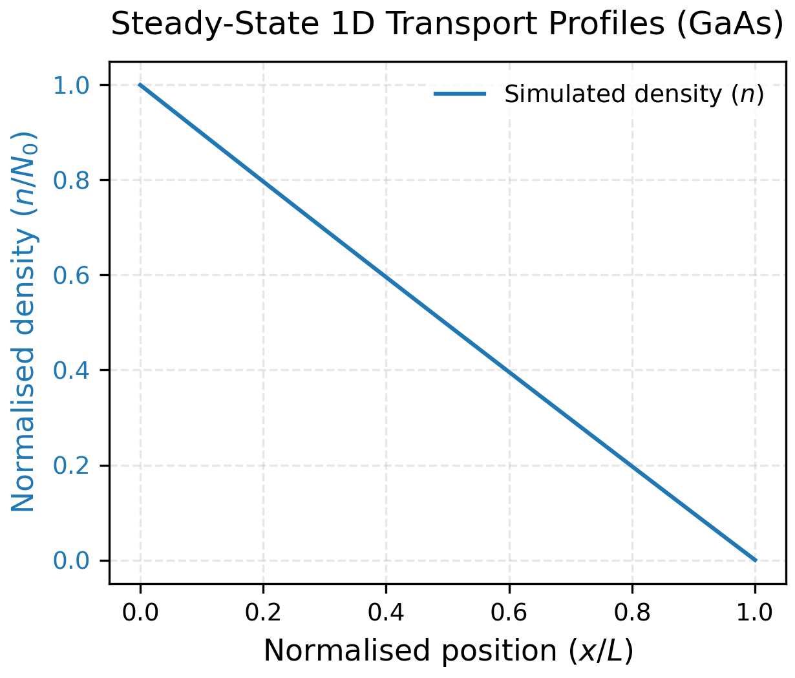
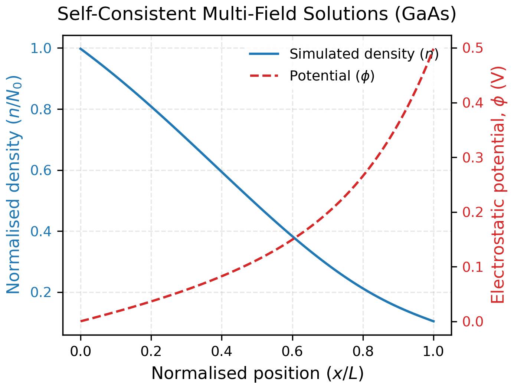

# SciForge: Scientific Computation Forge

SciForge is a computational science, scientific ML and data engineering platform. The capabilities of SciForge (*will eventually*) range from numerical integration, to Monte Carlo methods, to solving partial differential equations (PDEs) using a Physics-Informed Neural Network (PINN), to publication ready visualisations.

Motivating this platform was a desire to develop a suite of computational science, data pipeline management and scientific ML tools. It is to serve as a reference for people seeking to learn computational science, and students aswell as professionals requiring such tools in their workflows. Additionally it will act as a platform for my own technical development to support my own personal and professional work.

**This platform is underdevelopment so expect things to change frequently and extensively!**

**Currently in an alpha stage, i.e. official releases will follow soon!**

---

## Materials Toolkit (MatKit) Architecture

The MatKit aspect of the platform is designed around a decoupled, pipeline-centric architecture:

```text
┌────────────────────────┐      ┌────────────────────────┐      ┌────────────────────────┐
│  Public Physics API    │ ───> │   Materials Pipeline   │ ───> │  PostgreSQL Database   │
│                        │      │  (Ingestion & Clean)   │      │    (Native Dev/Prod)   │
└────────────────────────┘      └────────────────────────┘      └────────────────────────┘
                                                                            │
┌────────────────────────┐      ┌────────────────────────┐                  │
│   Production-Ready     │ <─── │   Carrier PINN Engine  │ <────────────────┘
│   Material Insights    │      │ (Multi-Engine Factory) │
└────────────────────────┘      └────────────────────────┘
```

1. **Data Ingestion**: A decoupled ETL pipeline pulls structural material records, extracts semi-structured profiles, and targets them into a normalised storage infrastructure.
2. **Relational Data Management**: An object-relational mapping (ORM) layer maps parameters (such as effective mass $m^*$ and permittivity $\epsilon$) directly into localised database systems.
3. **Statistical Modeling**: An unsupervised learning engine standardises feature variance metrics and partitions materials using K-Means grouping.
4. **Simulation Solver**: A Multi-Layer Perceptron (MLP) dynamically fetches database records, updates loss functions based on physical boundary parameters, and tracks gradients via autograd to solve transport equations. Selects an interchangeable physics solver backend via runtime flags.

---

## MatKit Physics Formulations

The PINN engine supports two distinct, interchangeable physics solver backends via a unified `BasePhysicsSolver` abstract interface:

### 1. Constant Field Engine (`--engine constant`)
Solves the steady-state 1D Drift-Diffusion current continuity equation under an applied, uniform background electric field ($E$):

$$\mathcal{R}(x) = D_n \frac{d^2n}{dx^2} + \mu_n E \frac{dn}{dx} - R(x) = 0$$



### 2. Self-Consistent Coupled Poisson Engine (`--engine coupled`)
Solves a tightly coupled, highly non-linear multi-field system to resolve the internal electrostatic potential ($\phi$) alongside shifting charge densities ($n$) simultaneously:

$$\mathcal{R}_{\text{poisson}}(x) = \frac{d^2\phi}{dx^2} + \frac{q}{\epsilon_0 \epsilon_r} \left( N_D^+ - n(x) \right) = 0$$

$$\mathcal{R}_{\text{transport}}(x) = D_n \frac{d^2n}{dx^2} + \mu_n \left(-\frac{d\phi}{dx}\right) \frac{dn}{dx} + \mu_n \left(-\frac{d^2\phi}{dx^2}\right)n(x) = 0$$



Where:
* **Mobility Scaling**: Material mobility scales dynamically based on physical constraints fetched from your database: $\mu_n = \frac{0.14}{m^*}$.
* **Einstein Relation**: The diffusion coefficient is directly linked to the computed mobility via: $D_n = \mu_n \frac{k_B T}{q}$.
* **Loss Optimisation**: Network parameters are updated by minimising a joint loss metric combining hard Dirichlet edge mismatches with internal PDE structural residuals: $`\mathcal{L}_{\text{total}} = \mathcal{L}_{\text{boundary}} + \mathcal{L}_{\text{physics}}`$.

### Numerical Non-Dimensionalisation
To protect the PyTorch network graph from immediate gradient explosions ($inf$ and $nan$ losses caused by comparing micro-scale distances $10^{-6}\text{ m}$ against macro-scale carrier densities $10^{22}\text{ m}^{-3}$), the system operates entirely within a normalised mathematical scaling space:
* **Spatial Normalisation**: Coordinates are scaled where $1.0 \text{ unit} = 1.0 \times 10^{-6} \text{ m}$ (1 micron device length).
* **Density Normalisation**: Concentration values are mapped where $1.0 \text{ unit} = 1.0 \times 10^{22} \text{ m}^{-3}$.

The physics solver calculates derivatives on this stable 0.0 to 1.0 grid, balancing the underlying constants internally to keep loss metrics near order-of-magnitude $\sim 1.0$.

---

## MatKit Quickstart & Verification Checklist

Follow these chronological terminal steps to initialise the environment, configure infrastructure dependencies, and trigger the MatKit automation sequence.

**Note: materials parameters pipeline is currently implemented in a mock version for GaAs only during early development.**

### 1. Environment & Package Assembly
```bash
python3 -m venv .venv
source .venv/bin/activate
pip install --upgrade pip
pip install -e ".[dev]"
```

### 2. Local Database Service Configuration
```bash
sudo -u postgres psql -c "CREATE USER postgres_user WITH PASSWORD 'secure_pass'; CREATE DATABASE sciforge_db OWNER postgres_user;"
sudo -u postgres psql -d sciforge_db -c "GRANT ALL ON SCHEMA public TO postgres_user;"
```

### 3. Execution & Validation
```bash
chmod +x run_dev_env.sh
./run_dev_env.sh
```

### 4. Running the Complete Verification Suite
```bash
ruff check . && ruff format . --check
pytest test/
```

---

## Automated Code Manuals

Detailed code architecture documentation is generated using Sphinx and hosted live on GitHub Pages. To review the modules locally, compile the HTML build outputs:
```bash
cd docs
make html
```
